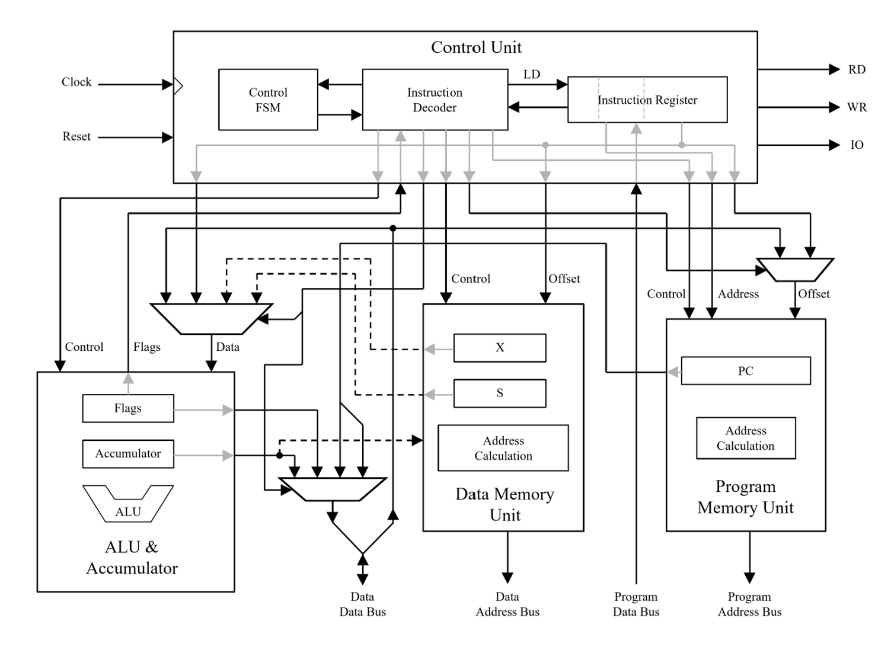

# Caltech10 CPU
The Caltech10 CPU was designed by Glen George for Caltech EE/CS 10a, Introduction to Digital Logic and Embedded Systems.
It was implemented for a final project by Garrett Knuf in ABEL (Advanced Boolean Expression Language).

The following modules were implemented and integrated:
* Arithmetic Logic Unit (ALU)
  * Performs all standard logical and arithmetic operations
  * One operand is always the accumulator and the other operand is a value from data memory or an immediate value encoded in instruction
  * ALU operations can affect sign (S), zero (Z), overflow (V), and carry (C) flags
* Program Access Unit (PAU)
  * Used to access code stored in program memory
  * The program memory address is always either from the program counter, possibly modified with a signed value from the instruction, or from the instruction itself for unconditional jumps and subroutine calls
* Data Access Unit (DAU)
  * Used to access data memory and I/O space
  * The data memory address can be formed from an absolute address in the instruction or by adding an offset in the isntruction to the value of one of the index registers (X or S)
  * Includes a RD signal to indicate a read operation, a WR signal to indicate a write operation, and an IO signal to indicate I/O space is being accessed instead of data memory
* Control Unit (CU)
  * 16-bit instruction register that holds the instruction to be executed and the logic for decoding this instruction
  * Contains simple state machine to control instruction executing for instructions that take multiple clock cycles to execute

